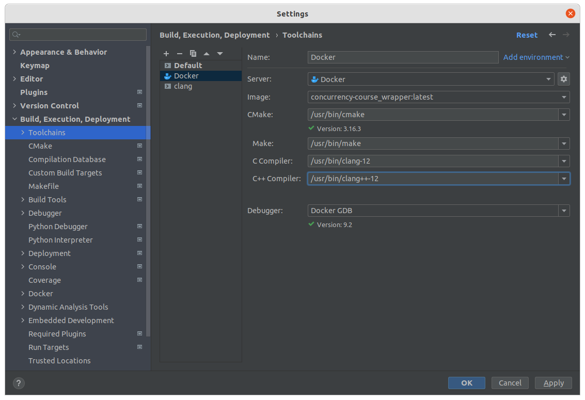
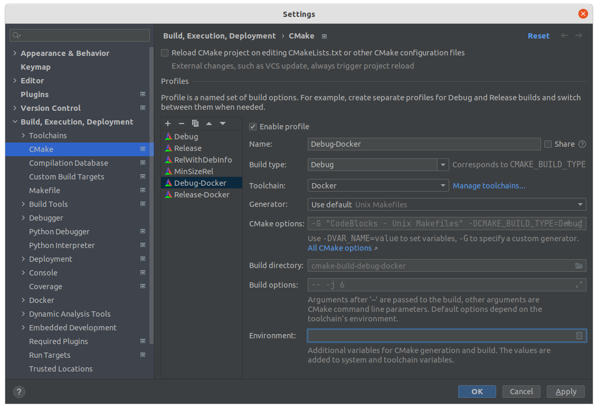

# Настройка CLion

## Начальная настройка

### Шаг 0

Установите самую свежую версию [CLion](https://www.jetbrains.com/ru-ru/clion/). CLion поддерживает тулчейн Docker начиная с версии 2021.3.

### Шаг 1

Курс – это CMake-проект, так что просто откройте его в CLion: `File` > `Open...` > выбрать директорию локального репозитория курса (`concurrency-course`).

### Шаг 2

Создаём [Docker Toolchain](https://www.jetbrains.com/help/clion/clion-toolchains-in-docker.html#create-docker-toolchain):

В `Preferences` → `Build, Execution, Deployment` → `Toolchains` создайте тулчейн Docker и убедитесь, что поля соотвествуют следующим значениям:

| Поле | Значение              |
|---|-----------------------|
| _Make_ | `/usr/bin/make`       |
| _C Compiler_ | `/usr/bin/clang-14`   |
| _C++ Compiler_ | `/usr/bin/clang++-14` |

Проверьте, что в поле `Make` содержится путь именно к `make`, а не к `cmake`.

### Шаг 3

В `Preferences` → `Build, Execution, Deployment` → `CMake` добавьте новый профиль сборки и установите в нем созданный шагом ранее тулчейн. 

Загрузка проекта CMake может занять около минуты.

### Шаг 4

Готово! Теперь можно выбрать в IDE цель с задачей / тестами и запустить её!

## Полезные советы

- В окошке `Terminal` можно залогиниться в контейнер и работать там с консольным клиентом `clippy` не покидая IDE.
