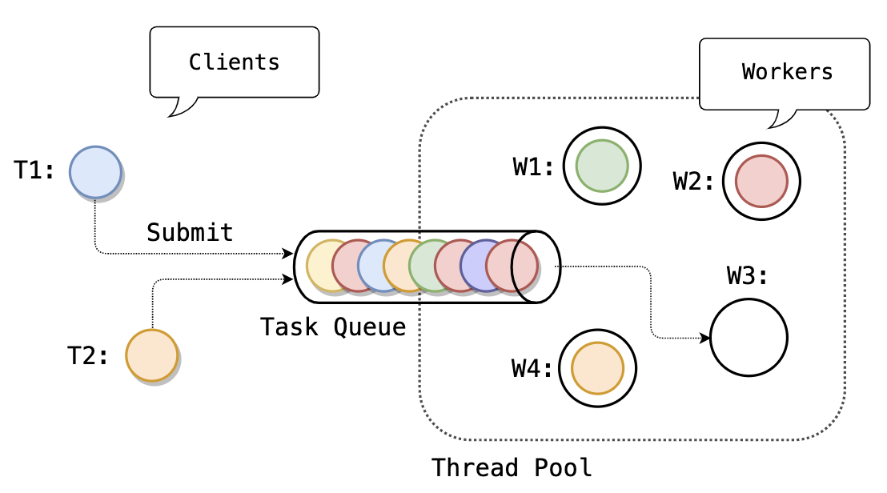

# Thread Pool

## Пререквизиты

- [mutex/mutex](/tasks/mutex/mutex)
- [cond/condvar](/tasks/cond/condvar)

----


В этой задаче мы построим базовый инфраструктурный компонент для параллельного исполнения задач – _пул потоков_ (_thread pool_).

Пул потоков будет _статическим_ – число потоков фиксируется при создании пула и не меняется до его остановки.

Далее с потоками и параллельностью мы будем работать **исключительно** через пулы.

## Схема работы



## `Start`

Пул должен быть запущен с помощью явного вызова метода `Start`:

```cpp
tp::ThreadPool pool{/*threads=*/4};

// Стартуем 4 потока-воркера
pool.Start();
```

Обратите внимание на функцию [`std::hardware_concurrency`](https://en.cppreference.com/w/cpp/thread/thread/hardware_concurrency).

## `Submit`

Пул потоков исполняет [задачи](tp/task.hpp) – функции без аргументов и возвращаемого значения.

Запланировать задачу на исполнение в пуле можно с помощью метода `Submit`:

```cpp
tp::ThreadPool pool{4};

pool.Start();

pool.Submit([] {
  fmt::println("Running on thread pool");
});
```

Вызов `Submit` не дожидается завершения задачи, он лишь добавляет ее в очередь задач пула, после чего возвращает управление.

Метод `Submit` можно вызывать из разных потоков, без внешней синхронизации.

### `Current`

Исполняемая в пуле потоков задача может получить указатель на текущий пул с помощью статического метода `Current`.

Метод `Current` возвращает
- указатель на текущий пул, если его вызвали из потока-воркера, и
- `nullptr` в противном случае.

### Пример
```cpp
tp::ThreadPool pool{4};

pool.Start();

pool.Submit([] {
  // Планируем задачу из задачи
  tp::ThreadPool::Current()->Submit([] {
    fmt::println("Continue");
  });
});
```

## `WaitIdle`

Метод `WaitIdle` блокирует вызвавший его поток до тех пор, пока в пуле не закончатся задачи.

Метод `WaitIdle` можно вызвать несколько раз, а можно не вызывать ни разу.

Метод не изменяет состояние пула, он только наблюдает за ним.

### Пример
```cpp
tp::ThreadPool pool{4};

pool.Start();

pool.Submit([] {
  std::this_thread::sleep_for(1s);
  tp::ThreadPool::Current()->Submit([] {
    fmt::println("Executed");
  });
});

// К моменту вызова WaitIdle вложенная задача скорее всего еще не была запланирована на исполнение.
// Но вызов WaitIdle дождется ее завершения.
pool.WaitIdle();
// <-- На экране напечатано "Executed"
```

## Исключения

Пул нечего не знает об исполняемых задачах,
так что единственной разумной реакцией на не обработанное пользовательской задачей исключение для пула будет аварийное завершение программы.

## `Stop`

Пул должен быть остановлен до своего разрушения явно с помощью метода `Stop`.

Вызов `Stop` возвращает управление, когда все потоки пула остановлены.

Вызвать метод `Stop` можно только один раз. 

Вызов `Stop` для пула означает, что новые задачи в него планироваться больше не будут.

## Управление пулом

Можно считать, что методы `Start`, `WaitIdle` и `Stop` вызываются только одним потоком, т.е. только последовательно.

## Очередь задач

Для распределения задач между потоками пула будем использовать `UnboundedBlockingQueue` – общую блокирующую очередь неограниченной емкости.

### API

| Метод | Семантика |
|---|---|
| `bool Put(T)` | Если очередь еще не закрыта (вызовом `Close`), то положить в нее `value` и вернуть `true`, в противном случае вернуть `false`. |
| `std::optional<T> Take()` | Дождаться и извлечь элемент из головы очереди; если же очередь закрыта и пуста, то вернуть `std::nullopt`. |
| `void Close()` | Закрыть очередь для новых `Put`-ов. Уже добавленные в очередь элементы останутся доступными для извлечения. |

### Bounded vs Unbounded

Обратите внимание: пулу потоков нужна очередь именно неограниченной емкости.

Придумайте сценарий дедлока в пуле с очередью, которая блокирует поток-продьюсер при переполнении буфера.

## Чего-то не хватает

Пул потоков не позволяет

- дождаться завершения задачи или получить из нее результат вычисления,
- задать зависимости между планируемыми задачами.

Мы не станем поддерживать эту функциональность на уровне пула (так что его API останется очень простым). Вместо этого мы вынесем ее в отдельный и ортогональный пулу механизм.

## Задание

1) Реализуйте блокирующую очередь – [`UnboundedBlockingQueue`](tp/queue.hpp)
2) Реализуйте пул потоков – [`ThreadPool`](tp/thread_pool.hpp)

Изучите [юнит-тесты](tests/thread_pool/unit.cpp) очереди и пула потоков чтобы разобраться с их поведением.

## Замечания по реализации

Вы можете добавлять в библиотеку `tp` новые файлы,

Добавлять новые публичные методы в очередь и пул нельзя, API пула и очереди является завершенным.

### `WaitIdle`

Методы `WaitIdle` и `Stop` должны быть ортогональны друг другу.

Изучите [Go by Example: WaitGroups](https://gobyexample.com/waitgroups), вам пригодится подобный примитив.

### Деструктор

Напишите `assert` в деструктор на случай забытого вызова `Stop`.

### `thread_local`

Задача тестируется под файберами, поэтому реализовать функцию `tp::Current` через [`thread_local`](https://en.cppreference.com/w/cpp/keyword/thread_local) указатель на пул мы не можем.

Вместо `thread_local` мы будем использовать `twist::ed::ThreadLocalPtr`:

- [Документация](https://gitlab.com/Lipovsky/twist/-/blob/master/docs/ru/guide.md#ptr)
- [Пример](https://gitlab.com/Lipovsky/twist/-/blob/master/examples/local/main.cpp)

### `stdlike`

[Опционально] Поместите в `stdlike` собственную реализацию мьютекса и кондвара и напишите пул потоков через них.
